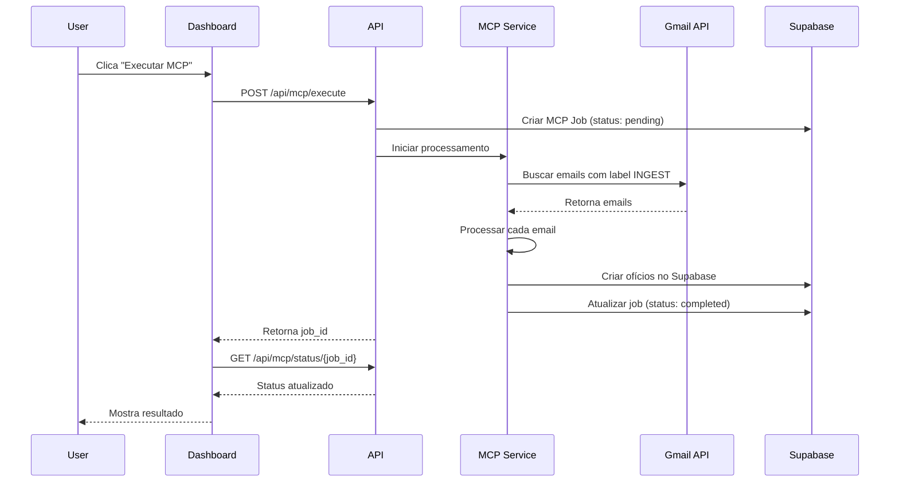

# 🏗️ MCP User-Friendly Architecture Document

## **Introduction**

Este documento analisa a implementação atual do MCP client para integração Gmail e propõe uma arquitetura user-friendly que prepare o sistema para futuras funcionalidades de RBAC (Role-Based Access Control) e multitenancy.

**Contexto Atual:**
- ✅ MCP client implementado para Gmail INGEST
- ✅ Scripts de automação configurados
- ✅ Integração com Supabase mantida
- 🔄 Necessidade de processo user-friendly
- 🔮 Preparação para RBAC e multitenancy

**Objetivo:**
Criar um processo que usuários possam executar facilmente, mantendo a flexibilidade para futuras expansões de segurança e multi-tenancy.

## **High Level Architecture**

### **Technical Summary**

A arquitetura atual combina MCP client para integração Gmail com autenticação Supabase, criando um sistema híbrido que permite processamento automático de emails com label INGEST. A solução proposta evolui para um sistema user-friendly com preparação para RBAC e multitenancy, mantendo a simplicidade atual enquanto permite escalabilidade futura.

### **Platform and Infrastructure Choice**

**Recomendação:** Manter arquitetura atual com extensões

**Plataforma Atual:**
- **Frontend:** Next.js + Supabase
- **Backend:** MCP Client + Python/GCP
- **Integração:** Gmail API via MCP
- **Deploy:** VPS + Docker

**Extensões Propostas:**
- **User Interface:** Dashboard para execução MCP
- **RBAC Foundation:** Estrutura de usuários e permissões
- **Multitenancy:** Isolamento por organização

## **Tech Stack**

| Category | Technology | Version | Purpose | Rationale |
|----------|------------|---------|---------|-----------|
| Frontend Framework | Next.js | 15.5.6 | UI e API Routes | Já implementado, mantém consistência |
| Authentication | Supabase Auth | Latest | Autenticação usuários | Base sólida para RBAC futuro |
| MCP Integration | Custom MCP Client | 1.0 | Integração Gmail | Processo user-friendly |
| Database | Supabase PostgreSQL | Latest | Dados e RLS | Preparado para multitenancy |
| State Management | React Context | Built-in | Estado da aplicação | Simplicidade e performance |
| API Style | REST + MCP | Hybrid | Comunicação | Flexibilidade para diferentes integrações |
| File Storage | Supabase Storage | Latest | Anexos Gmail | Integrado com auth |
| Monitoring | Custom Logs | - | Observabilidade | Logs estruturados para debug |

## **Data Models**

### **User Model**
**Purpose:** Gerenciar usuários e preparar para RBAC

**Key Attributes:**
- `id`: string - Identificador único do usuário
- `email`: string - Email do usuário (único)
- `name`: string - Nome completo
- `role`: enum - Papel do usuário (admin, user, viewer)
- `organization_id`: string - ID da organização (preparação multitenancy)
- `created_at`: timestamp - Data de criação
- `updated_at`: timestamp - Última atualização

**TypeScript Interface:**
```typescript
interface User {
  id: string;
  email: string;
  name: string;
  role: 'admin' | 'user' | 'viewer';
  organization_id: string;
  created_at: string;
  updated_at: string;
}
```

**Relationships:**
- Belongs to Organization
- Has many MCP Jobs
- Has many Gmail Integrations

### **MCP Job Model**
**Purpose:** Rastrear execuções do MCP client

**Key Attributes:**
- `id`: string - Identificador único
- `user_id`: string - Usuário que executou
- `status`: enum - Status da execução (pending, running, completed, failed)
- `gmail_account`: string - Conta Gmail processada
- `emails_processed`: number - Quantidade de emails processados
- `started_at`: timestamp - Início da execução
- `completed_at`: timestamp - Fim da execução
- `error_message`: string - Mensagem de erro (se houver)

**TypeScript Interface:**
```typescript
interface MCPJob {
  id: string;
  user_id: string;
  status: 'pending' | 'running' | 'completed' | 'failed';
  gmail_account: string;
  emails_processed: number;
  started_at: string;
  completed_at?: string;
  error_message?: string;
}
```

**Relationships:**
- Belongs to User
- Has many Processed Emails

## **API Specification**

### **REST API Specification**

```yaml
openapi: 3.0.0
info:
  title: MCP Gmail Integration API
  version: 1.0.0
  description: API para execução user-friendly do MCP client
servers:
  - url: https://oficio.ness.tec.br/api
    description: Production server
paths:
  /mcp/execute:
    post:
      summary: Executar MCP client
      requestBody:
        required: true
        content:
          application/json:
            schema:
              type: object
              properties:
                gmail_account:
                  type: string
                  description: Conta Gmail para processar
                label:
                  type: string
                  default: INGEST
                max_emails:
                  type: number
                  default: 50
      responses:
        '200':
          description: Execução iniciada
          content:
            application/json:
              schema:
                type: object
                properties:
                  job_id:
                    type: string
                  status:
                    type: string
                    enum: [pending, running]
  /mcp/status/{job_id}:
    get:
      summary: Verificar status da execução
      parameters:
        - name: job_id
          in: path
          required: true
          schema:
            type: string
      responses:
        '200':
          description: Status da execução
          content:
            application/json:
              schema:
                $ref: '#/components/schemas/MCPJob'
  /mcp/history:
    get:
      summary: Histórico de execuções
      parameters:
        - name: limit
          in: query
          schema:
            type: number
            default: 10
      responses:
        '200':
          description: Lista de execuções
          content:
            application/json:
              schema:
                type: array
                items:
                  $ref: '#/components/schemas/MCPJob'
components:
  schemas:
    MCPJob:
      type: object
      properties:
        id:
          type: string
        user_id:
          type: string
        status:
          type: string
          enum: [pending, running, completed, failed]
        gmail_account:
          type: string
        emails_processed:
          type: number
        started_at:
          type: string
          format: date-time
        completed_at:
          type: string
          format: date-time
        error_message:
          type: string
```

## **Components**

### **MCP Dashboard Component**
**Responsibility:** Interface user-friendly para execução do MCP client

**Key Interfaces:**
- `executeMCPJob(gmailAccount, options)` - Iniciar execução
- `getJobStatus(jobId)` - Verificar status
- `getJobHistory(limit)` - Histórico de execuções

**Dependencies:** Supabase Auth, MCP Client

**Technology Stack:** Next.js, React, TypeScript

### **MCP Service Component**
**Responsibility:** Lógica de negócio para execução MCP

**Key Interfaces:**
- `processGmailEmails(account, label)` - Processar emails
- `trackJobProgress(jobId)` - Rastrear progresso
- `handleJobCompletion(jobId, result)` - Finalizar execução

**Dependencies:** MCP Client, Database

**Technology Stack:** Node.js, TypeScript

### **RBAC Foundation Component**
**Responsibility:** Base para controle de acesso futuro

**Key Interfaces:**
- `checkUserPermission(userId, action)` - Verificar permissão
- `getUserRole(userId)` - Obter papel do usuário
- `validateOrganizationAccess(userId, orgId)` - Validar acesso à organização

**Dependencies:** Supabase Auth, Database

**Technology Stack:** Supabase RLS, TypeScript

## **Core Workflows**

### **MCP Execution Workflow**



## **Database Schema**

```sql
-- Tabela de usuários (preparação RBAC)
CREATE TABLE users (
  id UUID PRIMARY KEY DEFAULT gen_random_uuid(),
  email VARCHAR(255) UNIQUE NOT NULL,
  name VARCHAR(255) NOT NULL,
  role VARCHAR(50) DEFAULT 'user' CHECK (role IN ('admin', 'user', 'viewer')),
  organization_id UUID REFERENCES organizations(id),
  created_at TIMESTAMP DEFAULT NOW(),
  updated_at TIMESTAMP DEFAULT NOW()
);

-- Tabela de organizações (preparação multitenancy)
CREATE TABLE organizations (
  id UUID PRIMARY KEY DEFAULT gen_random_uuid(),
  name VARCHAR(255) NOT NULL,
  domain VARCHAR(255),
  created_at TIMESTAMP DEFAULT NOW()
);

-- Tabela de jobs MCP
CREATE TABLE mcp_jobs (
  id UUID PRIMARY KEY DEFAULT gen_random_uuid(),
  user_id UUID REFERENCES users(id),
  status VARCHAR(50) DEFAULT 'pending' CHECK (status IN ('pending', 'running', 'completed', 'failed')),
  gmail_account VARCHAR(255) NOT NULL,
  emails_processed INTEGER DEFAULT 0,
  started_at TIMESTAMP,
  completed_at TIMESTAMP,
  error_message TEXT,
  created_at TIMESTAMP DEFAULT NOW()
);

-- RLS Policies
ALTER TABLE users ENABLE ROW LEVEL SECURITY;
ALTER TABLE mcp_jobs ENABLE ROW LEVEL SECURITY;

-- Política: usuários só veem seus próprios dados
CREATE POLICY "Users can view own data" ON users
  FOR ALL USING (auth.uid() = id);

CREATE POLICY "Users can view own jobs" ON mcp_jobs
  FOR ALL USING (auth.uid() = user_id);
```

## **Frontend Architecture**

### **Component Architecture**

**Component Organization:**
```
src/
├── components/
│   ├── mcp/
│   │   ├── MCPDashboard.tsx
│   │   ├── MCPJobCard.tsx
│   │   ├── MCPHistory.tsx
│   │   └── MCPStatus.tsx
│   └── shared/
│       ├── Button.tsx
│       ├── Card.tsx
│       └── Loading.tsx
├── pages/
│   ├── dashboard/
│   │   └── mcp.tsx
│   └── api/
│       └── mcp/
│           ├── execute.ts
│           ├── status.ts
│           └── history.ts
└── hooks/
    ├── useMCPJobs.ts
    └── useMCPExecution.ts
```

## **Backend Architecture**

### **Service Architecture**

**Function Organization:**
```
src/
├── services/
│   ├── mcp/
│   │   ├── MCPExecutor.ts
│   │   ├── MCPJobTracker.ts
│   │   └── MCPGmailService.ts
│   └── auth/
│       ├── RBACService.ts
│       └── OrganizationService.ts
├── api/
│   └── mcp/
│       ├── execute.ts
│       ├── status.ts
│       └── history.ts
└── utils/
    ├── logger.ts
    └── validator.ts
```

## **Development Workflow**

### **Local Development Setup**

**Prerequisites:**
```bash
# Node.js 18+
node --version

# Docker (para MCP client)
docker --version

# Supabase CLI
npm install -g supabase
```

**Initial Setup:**
```bash
# Clone e instalar dependências
git clone <repo>
cd noficios
npm install

# Configurar ambiente
cp .env.example .env.local
# Editar .env.local com suas credenciais

# Iniciar Supabase local
supabase start

# Iniciar aplicação
npm run dev
```

## **Security and Performance**

### **Security Requirements**

**Frontend Security:**
- CSP Headers: `default-src 'self'; script-src 'self' 'unsafe-inline'`
- XSS Prevention: React built-in sanitization
- Secure Storage: Supabase Auth tokens

**Backend Security:**
- Input Validation: Zod schemas
- Rate Limiting: 10 requests/minute per user
- CORS Policy: Restrict to domain

**Authentication Security:**
- Token Storage: HttpOnly cookies
- Session Management: Supabase Auth
- Password Policy: Supabase defaults

### **Performance Optimization**

**Frontend Performance:**
- Bundle Size Target: < 500KB
- Loading Strategy: Lazy loading components
- Caching Strategy: SWR for API calls

**Backend Performance:**
- Response Time Target: < 2s
- Database Optimization: Indexes on user_id, status
- Caching Strategy: Redis para jobs em execução

## **Testing Strategy**

### **Testing Pyramid**

```
E2E Tests (MCP Integration)
/        \
Integration Tests (API + DB)
/            \
Frontend Unit  Backend Unit
```

## **Coding Standards**

### **Critical Fullstack Rules**

- **MCP Client Usage:** Sempre usar o serviço MCP, nunca chamadas diretas
- **Error Handling:** Todos os jobs MCP devem ter tratamento de erro
- **User Context:** Sempre validar user_id antes de executar MCP
- **Database Transactions:** Usar transações para operações críticas
- **Type Safety:** Usar tipos TypeScript em todas as interfaces MCP

### **Naming Conventions**

| Element | Frontend | Backend | Example |
|---------|----------|---------|---------|
| Components | PascalCase | - | `MCPDashboard.tsx` |
| Hooks | camelCase with 'use' | - | `useMCPJobs.ts` |
| API Routes | - | kebab-case | `/api/mcp/execute` |
| Database Tables | - | snake_case | `mcp_jobs` |
| Services | PascalCase | PascalCase | `MCPExecutor.ts` |

## **Error Handling Strategy**

### **Error Response Format**

```typescript
interface MCPError {
  error: {
    code: 'MCP_CONNECTION_ERROR' | 'MCP_PROCESSING_ERROR' | 'MCP_AUTH_ERROR';
    message: string;
    details?: {
      gmail_account: string;
      job_id: string;
      retry_after?: number;
    };
    timestamp: string;
    requestId: string;
  };
}
```

## **Monitoring and Observability**

### **Monitoring Stack**

- **Frontend Monitoring:** Console logs + Supabase Analytics
- **Backend Monitoring:** Custom logs + Supabase Analytics
- **Error Tracking:** Supabase Error Tracking
- **Performance Monitoring:** Custom metrics

### **Key Metrics**

**Frontend Metrics:**
- MCP execution success rate
- User interaction with dashboard
- API response times
- Error rates

**Backend Metrics:**
- MCP job completion rate
- Gmail API response times
- Database query performance
- Error rates by type
