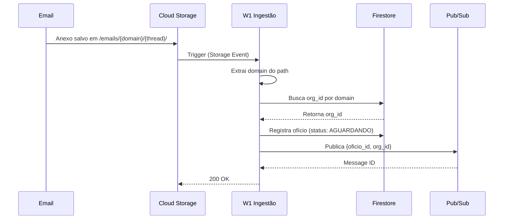
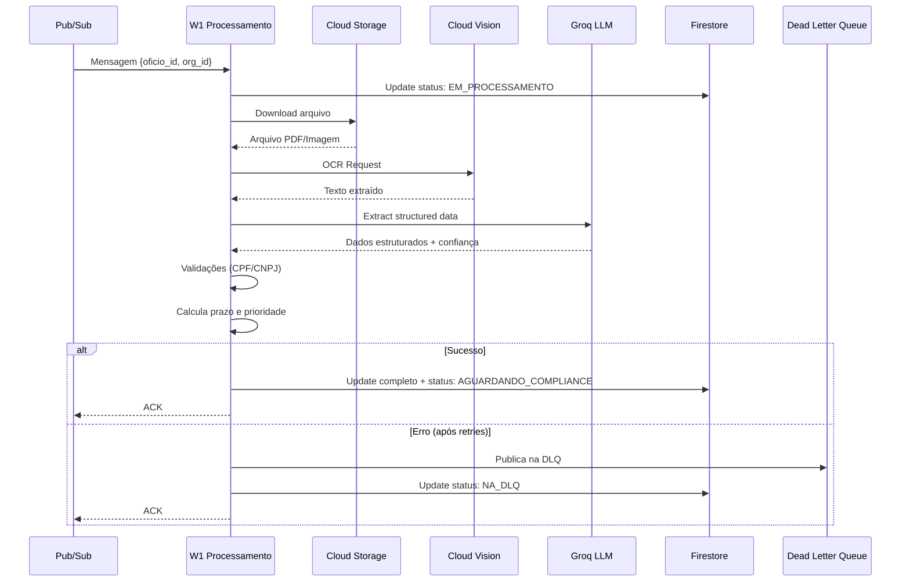

# Arquitetura - Sistema de Automação de Ofícios

## 🎯 Visão Geral

Sistema serverless para automação do processamento de ofícios judiciais, construído com arquitetura event-driven no Google Cloud Platform.

### Características Principais

- **Multi-Tenancy**: Isolamento completo de dados por organização
- **Serverless**: Cloud Functions escaláveis automaticamente
- **Event-Driven**: Processamento assíncrono via Pub/Sub
- **Resiliente**: Dead Letter Queue e retry automático
- **Seguro**: RBAC com Firebase Authentication
- **Auditável**: Trilha completa de auditoria

## 🏗️ Componentes da Arquitetura

```
┌─────────────────────────────────────────────────────────────────────┐
│                        ENTRADA DE DADOS                              │
└─────────────────────────────────────────────────────────────────────┘
                                   │
                        ┌──────────▼──────────┐
                        │   Gmail / Storage   │
                        │  (emails/anexos)    │
                        └──────────┬──────────┘
                                   │
                        ┌──────────▼──────────┐
                        │  Cloud Storage      │
                        │  Trigger            │
                        └──────────┬──────────┘
                                   │
┌─────────────────────────────────▼─────────────────────────────────┐
│                      W1: INGESTÃO (Gateway)                        │
│  • Identifica tenant (org_id) pelo domínio                         │
│  • Registra ofício no Firestore                                    │
│  • Publica mensagem no Pub/Sub                                     │
└─────────────────────────────────┬─────────────────────────────────┘
                                   │
                        ┌──────────▼──────────┐
                        │  Pub/Sub Topic      │
                        │  "processamento"    │
                        └──────────┬──────────┘
                                   │
┌─────────────────────────────────▼─────────────────────────────────┐
│                   W1: PROCESSAMENTO ASSÍNCRONO                     │
│  • OCR (Cloud Vision API)                                          │
│  • Extração estruturada (Groq LLM)                                 │
│  • Validações (CPF/CNPJ)                                           │
│  • Cálculo de prazos e prioridade                                  │
│  • Atualiza Firestore                                              │
└─────────────────────────────────┬─────────────────────────────────┘
                                   │
                    ┌──────────────┴──────────────┐
                    │                             │
         ┌──────────▼──────────┐    ┌───────────▼───────────┐
         │  Sucesso            │    │  Erro (após retries) │
         │  Status: AGUARDANDO │    │  Dead Letter Queue   │
         │  COMPLIANCE         │    │  Status: NA_DLQ      │
         └─────────────────────┘    └──────────────────────┘
                    │
                    │
┌───────────────────▼───────────────────────────────────────────────┐
│                    WORKFLOWS FUTUROS                               │
│  • W2: Monitoramento de SLA                                        │
│  • W3: Webhooks de atualização                                     │
│  • W4: Composição de resposta                                      │
└───────────────────────────────────────────────────────────────────┘
```

## 🔄 Fluxo de Dados Detalhado

### 1. Ingestão (W1_ingestao_trigger)



### 2. Processamento (W1_processamento_async)



## 🗄️ Modelo de Dados

### Firestore Schema

#### Coleção: `organizations`

```javascript
{
  "org_id": "auto-generated-id",
  "name": "Empresa XYZ Ltda",
  "email_domains": ["xyz.com.br", "xyz.com"],
  "settings": {
    "auto_process": true,
    "require_compliance_approval": true,
    "notification_email": "compliance@xyz.com.br"
  },
  "created_at": Timestamp,
  "updated_at": Timestamp
}
```

**Índices:**
- `email_domains` (array-contains)

#### Coleção: `oficios`

```javascript
{
  "oficio_id": "auto-generated-id",
  "org_id": "org-123",  // ⚠️ CRÍTICO para isolamento
  "thread_id": "email-thread-456",
  
  "status": "AGUARDANDO_COMPLIANCE",  // Enum
  
  "arquivo_original": {
    "bucket": "emails-bucket",
    "path": "emails/xyz.com.br/thread456/oficio.pdf",
    "size": 102400,
    "content_type": "application/pdf"
  },
  
  "anexos_urls": [
    "gs://emails-bucket/emails/xyz.com.br/thread456/anexo1.pdf"
  ],
  
  "conteudo_bruto": "Texto completo extraído via OCR...",
  
  "dados_extraidos": {
    "autoridade_nome": "Vara Criminal de São Paulo",
    "processo_numero": "1234567-89.2024.8.26.0100",
    "solicitacoes": [
      "Extratos bancários",
      "Comprovantes de renda"
    ],
    "prazo_dias": 10,
    "tipo_resposta_provavel": "dados",  // negativa | positiva | dados
    "confianca": 0.92,
    "org_id": "org-123",
    "thread_id": "email-thread-456"
  },
  
  "documentos_validados": {
    "cpfs_validos": ["123.456.789-09"],
    "cpfs_invalidos": [],
    "cnpjs_validos": ["11.222.333/0001-81"],
    "cnpjs_invalidos": []
  },
  
  "data_recebimento": Timestamp,
  "data_limite": Timestamp,
  "prioridade": "alta",  // alta | media | baixa
  
  "audit_trail": [
    {
      "user_id": "system",
      "timestamp": Timestamp,
      "action": "ingestion",
      "org_id": "org-123",
      "changes": ["created"]
    },
    {
      "user_id": "system",
      "timestamp": Timestamp,
      "action": "processing_complete",
      "org_id": "org-123",
      "changes": ["status", "dados_extraidos"]
    }
  ],
  
  "created_at": Timestamp,
  "updated_at": Timestamp,
  "processamento_completo_em": Timestamp
}
```

**Índices Compostos:**
1. `org_id` (ASC) + `status` (ASC) + `created_at` (DESC)
2. `org_id` (ASC) + `prioridade` (ASC) + `data_limite` (ASC)
3. `org_id` (ASC) + `created_at` (DESC)

### Estados do Ofício

```
AGUARDANDO_PROCESSAMENTO
    ↓
EM_PROCESSAMENTO
    ↓
AGUARDANDO_COMPLIANCE
    ↓
EM_ANALISE_COMPLIANCE
    ↓
APROVADO_COMPLIANCE
    ↓
AGUARDANDO_RESPOSTA
    ↓
RESPONDIDO

     ↓ (em caso de erro)
ERRO_PROCESSAMENTO → NA_DLQ
```

## 🔐 Segurança e Multi-Tenancy

### Princípios de Isolamento

1. **Firestore Queries**: Sempre incluir `org_id` no filtro
2. **RBAC**: Verificar `org_id` no token JWT
3. **Storage**: Estrutura `emails/{domain}/{thread}/`
4. **Auditoria**: Registrar `org_id` em todas as operações

### Matriz de Permissões

| Role              | Própria Org | Outras Orgs | System Operations |
|-------------------|-------------|-------------|-------------------|
| ROLE_USER         | Read        | ❌          | ❌                |
| ROLE_ORG_ADMIN    | Read/Write  | ❌          | ❌                |
| ROLE_PLATFORM_ADMIN| Read/Write  | Read/Write  | ✅                |

### Exemplo de Query Segura

```python
# ✅ CORRETO - Com isolamento
def get_oficio(org_id: str, oficio_id: str):
    doc = db.collection('oficios').document(oficio_id).get()
    data = doc.to_dict()
    
    if data['org_id'] != org_id:
        raise PermissionError("Access denied")
    
    return data

# ❌ ERRADO - Bypass de segurança
def get_oficio_insecure(oficio_id: str):
    doc = db.collection('oficios').document(oficio_id).get()
    return doc.to_dict()  # Sem verificação de org_id!
```

## 📊 Extração de Dados via LLM

### Pipeline de Extração

```
Texto OCR
    ↓
Prompt Engineering (system + user)
    ↓
Groq API (Llama 3.1 8B)
    ↓
JSON Response
    ↓
Pydantic Validation
    ↓
Dados Estruturados
```

### Prompt Template

```
System: Você é um assistente especializado em análise de ofícios judiciais.
        Extraia informações conforme o schema JSON fornecido.

User: Extraia as informações do seguinte ofício:
      
      [TEXTO_DO_OFICIO]
      
      Retorne JSON válido com: autoridade_nome, processo_numero, 
      solicitacoes, prazo_dias, tipo_resposta_provavel, confianca.
```

### Validações Pós-Extração

1. **Schema Validation**: Pydantic valida tipos e ranges
2. **CPF/CNPJ**: Algoritmo de dígitos verificadores
3. **Datas**: Parsing e cálculo de prazos
4. **Prioridade**: Baseada em prazo + tipo de resposta

## 🛡️ Resiliência e Tratamento de Erros

### Estratégia de Retry

```
Pub/Sub Message
    ↓
Tentativa 1 → Erro
    ↓ (exponential backoff)
Tentativa 2 → Erro
    ↓ (exponential backoff)
Tentativa 3 → Erro
    ↓
Dead Letter Queue
    ↓
Status: NA_DLQ no Firestore
    ↓
Alerta para operações
```

### Tipos de Erro

1. **Transientes**: Retry automático
   - Timeout de API
   - Rate limiting
   - Conectividade temporária

2. **Permanentes**: DLQ imediato
   - Arquivo corrompido
   - Formato não suportado
   - Organização não encontrada

### Monitoring Points

- Taxa de sucesso/falha
- Tempo médio de processamento
- Tamanho da DLQ
- Confiança média das extrações
- Distribuição de prioridades

## 🚀 Escalabilidade

### Limites e Capacidade

| Componente          | Limite Atual | Escalável para |
|---------------------|--------------|----------------|
| Cloud Functions     | 1000 inst.   | Ilimitado      |
| Firestore           | 10K reads/s  | 1M+ reads/s    |
| Pub/Sub             | 1M msgs/s    | 10M+ msgs/s    |
| Cloud Vision        | 1800 req/min | Enterprise     |
| Groq API            | Variável     | Conforme plano |

### Otimizações Futuras

1. **Caching**: Redis para dados frequentes
2. **Batching**: Processar múltiplos ofícios
3. **CDN**: Cache de anexos processados
4. **Indexação**: Elasticsearch para buscas
5. **ML Custom**: Fine-tuning para precisão

## 💰 Estimativa de Custos (GCP)

### Por 1000 ofícios/mês

| Serviço              | Uso Estimado       | Custo Mensal |
|----------------------|--------------------|--------------|
| Cloud Functions      | 2000 invocações    | $0.40        |
| Firestore            | 10K reads/writes   | $0.36        |
| Cloud Storage        | 10 GB              | $0.20        |
| Pub/Sub              | 2000 mensagens     | $0.02        |
| Cloud Vision         | 1000 páginas OCR   | $1.50        |
| **Total (infra)**    |                    | **~$2.50**   |
| Groq API             | 1000 chamadas      | Variável*    |

*Groq: Verificar pricing atual

### Escalabilidade de Custos

- 10K ofícios/mês: ~$25
- 100K ofícios/mês: ~$250
- 1M ofícios/mês: ~$2.5K (com otimizações)

## 📈 Roadmap de Evolução

### Fase 1: ✅ Fundação (Atual)
- Ingestão multi-tenant
- Processamento assíncrono
- OCR e extração LLM
- RBAC básico

### Fase 2: 🔄 Workflows (Próximo)
- W2: Monitoramento de SLA
- W3: Webhooks externos
- W4: Composição de respostas
- Dashboard analytics

### Fase 3: 🎯 Inteligência
- ML para classificação
- Sugestões de resposta
- Detecção de duplicatas
- Análise de sentimento

### Fase 4: 🚀 Enterprise
- Multi-região
- HA/DR
- SSO corporativo
- API pública documentada

## 🔍 Observability Stack

```
Logs → Cloud Logging → BigQuery → Looker Studio
        ↓
Metrics → Cloud Monitoring → Alerting
        ↓
Traces → Cloud Trace
        ↓
Errors → Error Reporting → Incident Response
```

### Key Metrics

- **Latência**: P50, P95, P99 por função
- **Taxa de Erro**: % por função e org
- **SLA**: % de ofícios dentro do prazo
- **Confiança**: Distribuição de scores LLM

## 📚 Referências Técnicas

- [GCP Cloud Functions](https://cloud.google.com/functions/docs)
- [Firestore Best Practices](https://cloud.google.com/firestore/docs/best-practices)
- [Pub/Sub Patterns](https://cloud.google.com/pubsub/docs/publisher)
- [Cloud Vision OCR](https://cloud.google.com/vision/docs/ocr)
- [Groq API](https://console.groq.com/docs)
- [Pydantic V2](https://docs.pydantic.dev/latest/)


